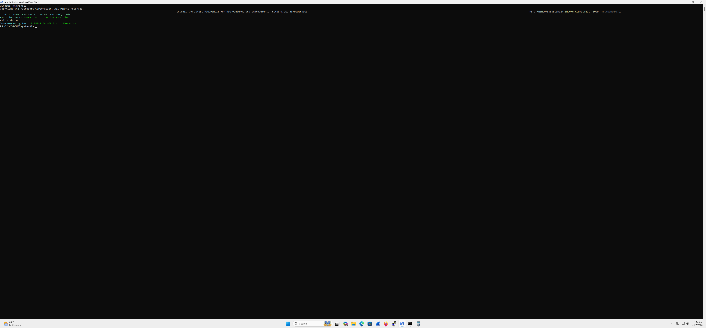
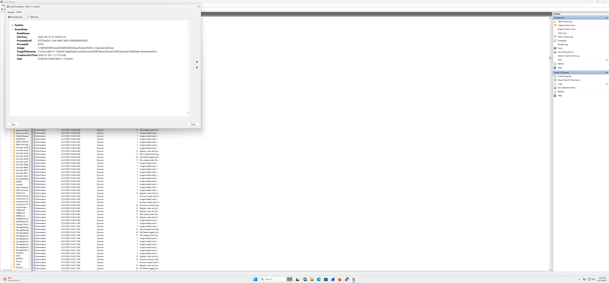
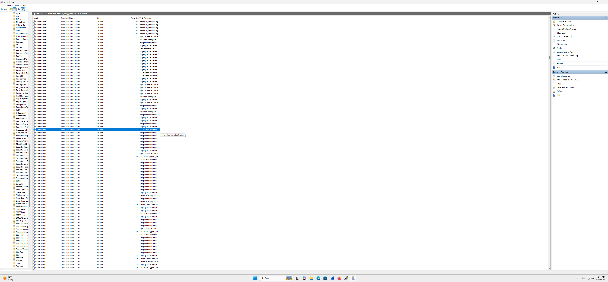
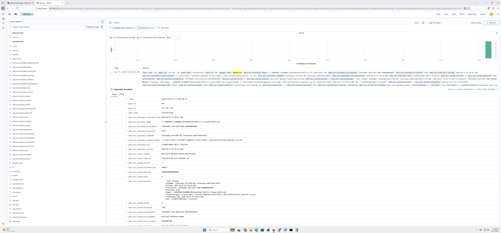

# Homelab-Documentation-Dell-
Documentation of my home lab build, including hardware, networking, virtualization, and self-hosted services.
This repository documents the design, setup, and maintenance of my home lab.
It includes hardware choices, network topology, virtualization setup, and
self-hosted services.

## Goals
- Learn networking and virtualization
- Self-host services
- Improve Linux and infrastructure skills
- Create reusable documentation

## Lab Overview
- Hypervisor: Oracle VirtualBox
- Networking: pfSense + VLANs
- Storage: NTFS(host OS), VirtualBox virtual disks

## Documentation
- [Hardware](docs/hardware.md)
- [Network](docs/network.md)
- [Virtualization](docs/virtualization.md)

> IPs, hostnames, and secrets are sanitized.

# My Image Page

Here is my screenshot:

Here is my screenshot:

Here is my screenshot:

